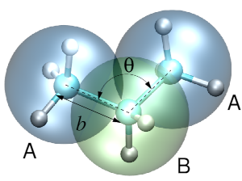

Introduction
============

Versatile Object-oriented Toolkit for Coarse-graining Applications, or
votca, is a package which helps to systematically coarse-grain various
systems [Ruehle:2009.a]_. This includes deriving the
coarse-grained potentials, assessing their quality, preparing input
files required for coarse-grained simulations, and analyzing the latter.

A typical coarse-graining workflow includes *sampling* of the system of
interest, *analysis* of the trajectory using a specific *mapping* and a
coarse-graining *method* to derive coarse-grained potentials and, in
case of iterative methods, running coarse-grained simulations and
iteratively *refining* the coarse-grained potentials.

In most cases, coarse-graining requires canonical sampling of a
reference (high resolution) system. In addition, iterative methods
require canonical sampling of the coarse-grained system. The sampling
can be done using either molecular dynamics (MD), stochastic dynamics
(SD), or Monte Carlo (MC) techniques. The latter are implemented in many
standard simulation packages. Rather than implementing its own MD/SD/MC
modules, votcaallows swift and flexible integration of existing programs
in such a way that sampling is performed by the program of choice. At
the moment, an interface to GROMACS [gromacs4]_
simulation package is provided. The rest of the analysis needed for
systematic coarse-graining is done using the package tools.

    Three-bead coarse-grained model of propane.

The workflow can be exemplified on coarse-graining of a propane liquid.
A single molecule of propane contains three carbon and eight hydrogen
atoms. A united atom coarse-grained representation of a propane molecule
has three beads and two bead types, A and B, with three and two
hydrogens combined with the corresponding atom, as shown in
the figure above. This representation defines the , as well as
the bonded coarse-grained degrees of freedom, such as the bond :math:`b`
and the bond angle :math:`\theta`. Apart from the bonded interactions,
:math:`u_b` and :math:`u_\theta`, beads belonging to different molecules
have non-bonded interactions, :math:`u_\text{AA}`, :math:`u_\text{AB}`,
:math:`u_\text{BB}`. The task of coarse-graining is then to derive a
potential energy surface :math:`u` which is a function of all
coarse-grained degrees of freedom. Note that, while the atomistic bond
and angle potentials are often chosen to be simple harmonic functions,
the coarse-grained potentials cannot be expressed in terms of simple
analytic functions. Instead, tabulated functions are normally used.

The coarse-graining *method* defines criteria according to which the
potential energy surface is constructed. For example, for the bond
:math:`b` and the angle :math:`\theta`  can be used. In this case a
coarse-grained potential will be a potential of mean force. For the
non-bonded degrees of freedom, the package provides or methods. In this
case the radial distribution functions of the coarse-grained model will
match those of the atomistic model. Alternatively, (or multiscale
coarse-graining) can be used, in which case the coarse-grained potential
will approximate the many-body potential of mean force. The choice of a
particular method is system-specific and requires a thorough consistency
check. It is important to keep in mind that coarse-graining should be
used with understanding and caution, methods should be crossed-checked
with each other as well as with respect to the reference system.

The package consists of two parts: a C++ kernel and a scripting engine.
The kernel is capable of processing atomistic topologies and
trajectories and offers a flexible framework for reading, manipulating
and analyzing topologies and generated by MD/SD/MC sampling
trajectories. It is modular: new file formats can be integrated without
changing the existing code. Currently, an interface for
GROMACS [gromacs4]_ topologies and trajectories is
provided. The kernel also includes various coarse-graining tools, for
example calculations of probability distributions of bonded and
non-bonded interactions, correlation and autocorrelation functions, and
updates for the coarse-grained pair potential.

The scripting engine is used to steer the iterative procedures. Here the
analysis tools of the package used for sampling (e.g. GROMACStools) can
be integrated into the coarse-graining workflow, if needed. The
coarse-graining workflow itself is controlled by several Extensible
Markup Language (XML) input files, which contain mapping and other
options required for the workflow control. In what follows, these input
files are described.

Before using the package, do not forget to initalize the variables in
the bash or csh (tcsh)

::

      source <csg-installation>/bin/VOTCARC.bash
      source <csg-installation>/bin/VOTCARC.csh

More details as well as several examples can be found in
ref. [Ruehle:2009.a]_. Please cite this paper if you
are using the package. Tutorials can be found on the votcahomepage .

.. |image| image:: fig/propane
   :width: 4.00000cm
