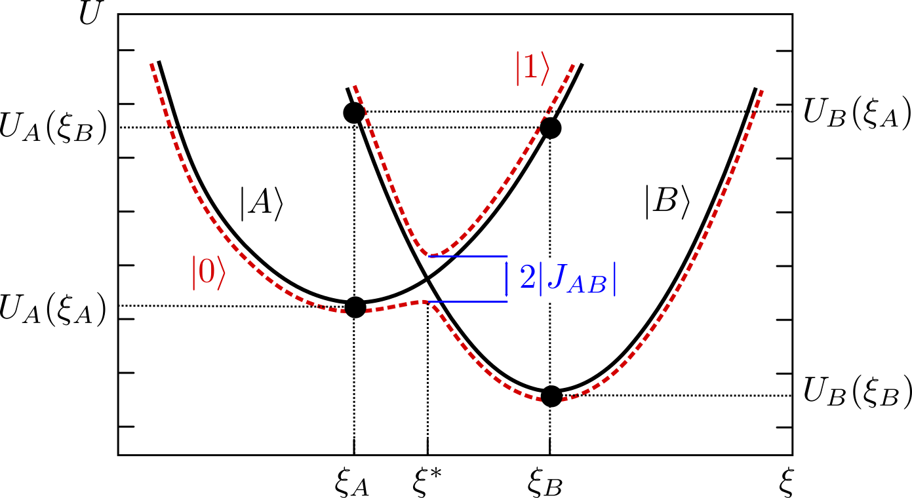

Charge and Energy Transfer Theory
#################################
The basic process of all rate models is the excitation transfer reaction from a donor molecule :math:`A` to an acceptor molecule :math:`B`: 

.. math::
    A^*B\longrightarrow AB^*,

where :math:`A^*` denotes a molecule :math:`A` in its excited state. The excitation can either be a single particle excitation, as a hole or electron, or a two-particle excitation, like a singlet or triplet exciton. For the two molecule system we introduce the adiabatic states :math:`\ket{0}` and :math:`\ket{1}`, which depend on the set of nuclear coordinates, :math:`\mathbf{R}`. Instead of this multidimensional space, we focus on the one-dimensional reaction coordinate :math:`\xi`, which is some linear combination of all nuclear coordinates. 

Adiabatic vs Diabatic States
****************************

The adiabatic potential energy surface is plotted :numref:`fig_theory_reorg`. For a given molecular arrangement, denoted :math:`\xi_A`, the excitation localizes on molecule :math:`A` and for :math:`\xi_B` on molecule :math:`B`. Expanded in the adiabatic states, the full Hamiltonian of the dimer complex can be expressed as:

.. math::

    \mathcal{H}^{AB}=\sum_{i=0,1}\hat{H}^i_\text{nuc}(\xi)\ket{i}\bra{i}+\hat{\Theta}^{01}(\xi)\ket{0}\bra{1}+\hat{\Theta}^{10}(\xi)\ket{1}\bra{0},

Transitions between these states are mediated by the matrix elements :math:`\hat{\Theta}^{01}` and :math:`\hat{\Theta}^{10}` of the *non-adiabicity* operator :math:`\hat{\Theta}^{ij}`. If the system is in either state :math:`\ket{0}` or :math:`\ket{1}` the nuclear dynamics are governed by:

.. math::
    :label: equ:theory:ham_adiab

    \hat{H}^{0/1}_\text{nuc}(\xi)=\hat{T}_\text{nuc}+\underbrace{\hat{V}_\text{nuc-nuc}+\hat{\Theta}^{0/1}(\xi)+E_{el}^{0/1}(\xi)}_{=U^{0/1}(\xi)}

.. _fig_theory_reorg:

    Diabatic (black) and adiabatic (red dashed) potential energy surfaces along the reaction coordinate :math:`\xi`. Whereas the adiabatic surfaces do not cross, but change character, the diabatic states retain their chemical character but cross. The electronic coupling :math:`J_{AB}` can be read of as half the energetic separation between :math:`\ket{0}` and :math:`\ket{1}` at :math:`\xi^*`.

In the case of a delocalized system, the electronic excitation is well described by :math:`\ket{0}` and the nuclear motion will be governed by :math:`\hat{H}^0` from :eq:`equ:theory:ham_adiab`. This situation corresponds to a large split of the adiabatic energy surfaces (:math:`J_{AB}` in :numref:`fig_theory_reorg`).

If the electronic excitation is strongly localized on molecule :math:`A`, :math:`\ket{0}` alone would describe it poorly. Instead a mixture of adiabatic states is needed to describe the localized state. These adiabatic states couple due to the *non-adiabacity* operator. To ease the calculation we introduce a localized electronic basis, known as the *diabatic basis*.

The diabatic states :math:`\ket{A}`, :math:`\ket{B}` are related to the adiabatic basis :math:`\ket{0}`,:math:`\ket{1}` via a basis transformation:

.. math::

    \begin{pmatrix}
    \ket{A(\xi_0)}\\
    \ket{B(\xi_0)}
    \end{pmatrix}
    =
    \underline{\mathbf{T}}(\xi)
    \begin{pmatrix}
    \ket{0(\xi)}\\
    \ket{1(\xi)}
    \end{pmatrix}

The transformation matrix :math:`\underline{\mathbf{T}}(\xi)` is chosen in such a way to absorb the dependence on the nuclear coordinates :math:`\xi`. In :numref:`fig_theory_reorg` the adiabatic and diabatic states are shown. Whereas adiabatic states localize or not localize depending on the nuclear geometry, diabatic states are always localized. They are defined in one reference nuclear configuration, :math:`\xi_0`, and so do not carry any dependence on the nuclear coordinates anymore, hence their matrix elements with the non-adiabicity operator vanish:

.. math::
    :label: equ:theory:diabaticdef

    \bra{X}\hat{\Theta}\ket{Y}=0\,\; \text{with}\, X,Y\in\{A,B\}.

They are no longer eigenstates of the electronic Hamiltonian, except at :math:`\xi_0`:

.. math::

    \hat{H}_\text{el}(\xi_0)\ket{X}=E_\text{el}^X\ket{X}, \text{with}\, X\in\{A,B\}.

In the thus defined *diabatic basis* the Hamiltonian reads:

.. math::

 \mathcal{H}^{AB}=\hat{H}^A_\text{nuc}(\xi)\ket{A}\bra{A}+\hat{H}^B_\text{nuc}(\xi)\ket{B}\bra{B}+J_{AB}\left(\ket{A}\bra{B}+\ket{B}\bra{A}\right)

As all terms containing the non-adiabicity operator vanish, electronic coupling between the diabatic states is introduced via:

.. math::
    :label: equ:theory:electroniccoupling

    J_{AB}(\xi)=\bra{A}\hat{H}_\text{el}(\xi)\ket{B}

If the system is in one of the diabatic states :math:`\ket{A}` or :math:`\ket{B}`, the nuclear dynamics are described by the following Hamiltonian:

.. math::

    \hat{H}^{A/B}_\text{nuc}=\hat{T}_\text{nuc}+\underbrace{\hat{V}_\text{nuc-nuc}+J_{AA/BB}(\xi)+E_\text{el}^{A/B}}_{=U^{A/B}(\xi)}

In :numref:`fig_theory_reorg` the diabatic energy surfaces cross at :math:`\xi^*`. This is necessary as diabatic states are localized, i.e. for certain molecular configurations (:math:`\xi>\xi^*` state :math:`\ket{B}` is energetically more optimal than :math:`\ket{A}`). Adiabatic states/surfaces exhibit an avoided crossing at :math:`\xi^*`, as they cannot cross because an adiabatic state is always defined with respect to its energy, i.e. the ground state adiabatic state is defined as the lowest energy state. Instead, the adiabatic state changes character from being more localized on :math:`A` to being more localized on :math:`B`. 

Electron Transfer Rates in the Marcus Picture
*********************************************

Using the diabatic basis, we proceed by calculating the rate expression :math:`\omega_{A\rightarrow B}`. As the excitation is localized :math:`J_{AB}` is small and can be treated as a perturbation [Marcus:1993]_. Using Fermi's golden rule yields:

.. math::
    :label: equ:theory:fermigr

    \omega_{A\rightarrow B}=\frac{2\pi}{\hbar}|J_{AB}|^2\int f(\xi)\delta(U_A(\xi)-U_B(\xi))\,d\xi,

with the integration over all configuration :math:`\xi` weighted by the Boltzmann factor :math:`f(\xi)\propto \exp(-U_A(\xi)/k_BT)`. The delta-function enforces energy-conservation, as a transition can only happen at the crossing point :math:`\xi^*`, where :math:`U_A(\xi^*)=U_B(\xi^*)`. We also neglect the dependency of :math:`J_{AB}` on :math:`\xi` as in the *Condon approximation*.

If the diabatic PESs :math:`U_A(\xi)` and :math:`U_B(\xi)` are known the rate equation :eq:`equ:theory:fermigr` can be solved. For most systems the computational cost of calculating the PES is too large and so the PESs have to be approximated. The first simplification is the introduction of the reaction coordinate :math:`\xi`. If we go back one step and look at a general PES :math:`U(\mathbf{R})`, with some minimum at :math:`\mathbf{R}^0`, we can expand it to second order around that minimum:

.. math::

    U(\mathbf{R})=U^0+\sum_{ij} h_{ij} (R_i-R_i^0)(R_j-R_j^0)=U^0+\sum_{a} \omega_a (Q_a-Q_a^0)^2=U(\mathbf{Q}),

where :math:`Q_a` are mass weighted normal mode coordinates with eigenfrequencies :math:`\omega_a`, obtained by diagonalizing the Hessian matrix :math:`h_{ij}`. The excitation transfer reaction is typically triggered by a subset of these eigenmodes. Often the nuclear motion can be described as a linear combination of these eigenmodes, yielding the reaction coordinate, :math:`\xi`, with its eigenfrequency :math:`\omega_\xi` and conjugate momentum operator :math:`\hat{P}_\xi`. The corresponding nuclear Hamiltonian then reads:

.. math::

    \hat{H}_\text{nuc}=\frac{1}{2} \hat{P}_\xi^2+U^0+\frac{1}{2} \omega_\xi (\xi-\xi^0)^2.

Treating the oscillations along :math:`\xi`, i.e. the promoting mode, classically we arrive at the Marcus rate equation [Marcus:1993]_:

.. math::
    :label: equ:theory:marcus

    \omega_{A\rightarrow B}=\frac{2\pi}{\hbar}\frac{|J_{AB}|^2}{\sqrt{4\pi \lambda k_B T}}\exp \left[ -\frac{(U_{AB}-\lambda)^2}{4\lambda k_BT}\right].

Here :math:`\lambda` denotes the classical reorganization energy, which describes the molecular rearrangement necessary for the excitation transfer to happen

.. math::

    \lambda=\frac{1}{2}\omega_\xi(\xi_A-\xi_B)^2.

If the dimer complex is surrounded by other molecules environmental reorganization effects may also contribute. These can be described by an additional harmonic mode :math:`\tilde{\xi}`, yielding the outer sphere reorganization energy:

.. math::

    \lambda^\text{out}=\frac{1}{2}\omega_{\tilde{\xi}}(\tilde{\xi}_A-\tilde{\xi}_B)^2.

:math:`U_{AB}` in :eq:`equ:theory:marcus` is the energy difference:

.. math::

    U_{AB}=U_A(\xi_A)-U_B(\xi_B)

The Marcus rate has been used to great success to describe charge transfer in solution and solids. The classical treatment of the promoting modes :math:`\xi,\tilde{\xi}` is only justified if :math:`k_BT\gg\omega_\xi,\omega_{\tilde{\xi}}`. This is rarely the case, as intramolecular vibrations have zero-point energies of around 0.1eV, which is roughly four times the thermal energy at room temperature. Yet, the Marcus theory has been shown to give good results even at the limits of its validity. Other rate expression like, Marcus-Levich-Jortner rates, which treat the promoting mode quantum mechanically or Weiss-Dorsey rates, which treat the whole system quantum mechanically, extend the formal applicability of transfer rate theories. Unfortunately, these rates require additional input parameters to describe the PES, which can only be obtained at substantial computational cost.

Monomer States as Approximations to Diabatic States
***************************************************

Computational cost is already a major concern, as diabatic states, defined via :eq:`equ:theory:diabaticdef`, are very difficult or even impossible to calculate. Practically, the diabatic states have to be approximated. As the diabatic state :math:`\ket{A}` resembles an excited monomer :math:`A` and a ground state molecule :math:`B`, the following simplification is used:

.. math::
    :label: equ:theory:diabaticstateapprox

    \ket{A}\approx \ket{1_a}\otimes\ket{0_b}

The diabatic state is approximately the product of the adiabatic excited state of the isolated monomer :math:`A`, :math:`\ket{1_a}` and the ground state of the isolated monomer :math:`B`, :math:`\ket{0_b}`. All energetic contributions separate into monomer contributions as well e.g.:

.. math::
    :label: equ:coarsesiteE

    \begin{align}
    U_{AB}&=U_A(\xi_A)-U_B(\xi_B)\approx U_a^1(\xi_a^1)+U_b^0(\xi_b^0)-(U_a^0(\xi_a^0)+U_b^1(\xi_b^0)\nonumber\\
    &=\underbrace{(U_a^1(\xi_a^1)-U_a^0(\xi_a^0))}_{\Delta E_a}-\underbrace{(U_b^1(\xi_b^1)-U_b^0(\xi_b^0))}_{\Delta E_b}=\Delta E_{ab},
    \end{align}

where :math:`\Delta E_{ab}` is the site energy difference between the molecules and :math:`\xi_{a/b}^{0/1}` are the molecular configuration of monomer :math:`A/B` in state :math:`0/1`. 

.. Hopping transport
.. *****************

