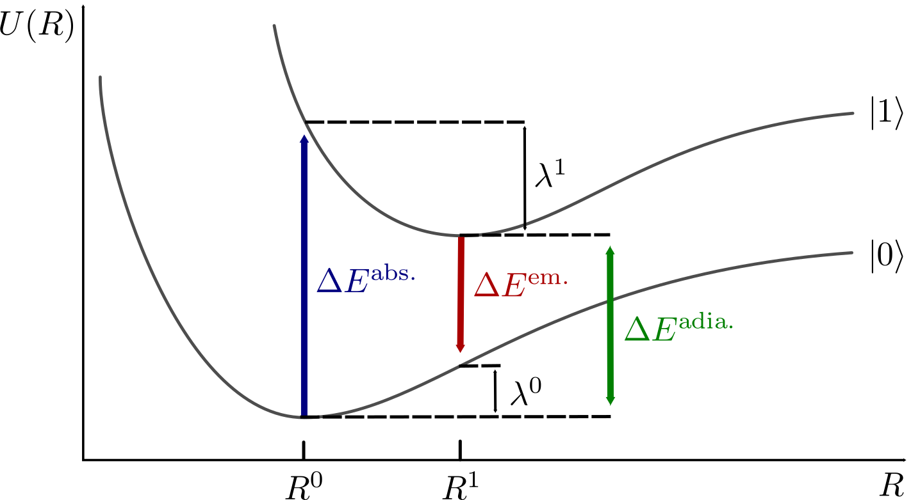
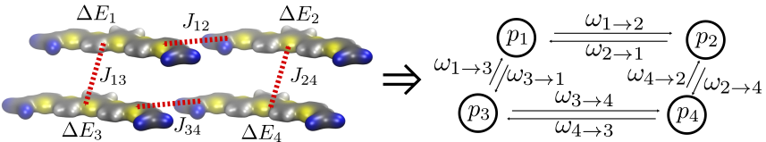

Charge and Energy Transport Model
#################################

Partitioning of the system
**************************

Before the charge or exciton dynamics can be calculated using rate models, a given morphology has to be divided into sites, on which excitations localize. This requires knowledge of the localization of the electronic states, as each site should preferably contain a single diabatic state of the complete system. In detail knowledge of the localization requires electronic structure calculations of the whole system, which are not feasible for larger systems. Instead, the partitioning into segments can only be justified a posteriori by assessing the magnitude of the electronic couplings between segments. 

.. _fig_theory_fragment_def:
.. figure:: fig/fragment_def.svg
    :width: 400
    :align: center

    Partitioning scheme as employed in VOTCA. a) For small, inflexible molecules, the whole molecule is replaced by a rigid fragment. b) For larger molecules, more fragments are used to allow for some flexibility for the slower degrees of freedom. The whole molecule is still one segment. c) For a polymer, the chain is cut into segments, using input from quantum mechanical studies. Each segment may also contain more than one rigid fragment.

In many systems chemical intuition allows defining partitioning, which satisfies this test retrospectively, e.g., in most organic electronic systems a conjugated system is a good minimal guess. As shown in :numref:`fig_theory_fragment_def` all atoms belonging to a single site are collectively referred to as a conjugate segment. 

In small molecule systems each molecule is typically chosen as a single conjugated segment, because electronic structure calculations typically show complete delocalization of electronic states over the individual molecules. In polymeric systems this simple approach may fail, as torsion of the backbone and electron-phonon interaction may lead to localization on polymeric subunits instead of delocalization over the whole polymer chain. In these cases quantum mechanical calculations of the whole chain are necessary to determine localization sites.

After the system is partitioned into segments, these segments are additionally separated into rigid fragments, as depicted in :numref:`fig_theory_fragment_def`. These fragments are typically insensitive to thermal fluctuations, e.g., a thiophene or benzene ring stays planar even at elevated temperatures. Although the fragment definitions are theoretically not necessary for the calculation of rates, the molecular dynamics configurations of the rigid fragments are often replaced with quantum mechanically optimized rigid fragments, in order to *integrate out* fast degrees of freedom, e.g. the promoting modes, which are already described in the rate models. This has the additional benefit of removing some of the mismatch between quantum mechanically obtained geometries and molecular dynamics results.  

Site Energies
*************

The site energy, :math:`\Delta E_a`, of a molecule :math:`a` is basically defined via :eq:`equ:coarsesiteE`. Although this is a simple definition it is frayed with computational difficulties as the energy :math:`U_a` not only depends on the isolated molecule but also the chemical environment it is located in. As discussed before, the electronic state also must be sufficiently localized on the molecule to even make the definition of a site energy valid. Sufficient localization entails weaker coupling to the surrounding, allowing us to treat the chemical environment as a small perturbation to the electronic state. 

Although there are exchange, dispersion, and electrostatic inrteractions between molecules, we focues only on the last, electrostatic interaction. There are a couple of reasons for this approximation. Firstly, we are not really interested in the absolute values of site energies but in differences between different electronic states, e.g. :math:`\Delta E_a=U^1_a-U^0_a`. Consequently, all interactions, which influence both states nearly equally, e.g. dispersion interaction, cancel out. Secondly, electrostatic interaction is very directional, thus it is very sensitive to changes in the charge distribution on the molecules. Thirdly, and most importantly it is typically the strongest interaction present, due to its slow decay with distance. So the site energy of a molecule :math:`a` in state :math:`i` is decomposed into the energy from the internal degrees of freedom :math:`E_\text{int}` and the electrostatic contribution from the environment :math:`E_\text{estat}`:

.. math::
    :label: equ:coarse:siteenergydiff

    U_a^i(\xi_a^i)\approx E_\text{int}^i+E_\text{estat}^i

The internal site energy difference :math:`\Delta E_{\text{int}}=E_{\text{int}}^1-E_{\text{int}}^0` can be calculated from the vacuum PES of the single molecule via:

.. math::
    :label: equ:interalsiteenergy

    \Delta E_{\text{int}}= U^1_\text{vac}(\xi^1_a)-U^0_\text{vac}(\xi^0_a).

Theoretically :math:`\Delta E_a` is an adiabatic excitation energy calculated from the respective geometries for the ground and excited state. Depending on the electronic excitation (electron, hole, exciton) and the system at hand, slow (compared to the timescale of hopping) vibrational modes may seriously change the local excitation energy by distorting molecular geometries. These distortions lead to disorder in the internal site energies. Using vacuum optimized geometries may not be a good approximation, as they optimize out this dynamic, but on the timescale of electronic motion, frozen disorder. In practice geometries from molecular dynamics simulations are used for the ground and excited states, using the mapping procedure described earlier to account for the geometry reorganization upon excitation in the site energies.

As mentioned above, the electrostatic contribution to the site energy of a molecule :math:`E_{\text{estat}}^i` depends on the surrounding. The question is how to treat this effect. A fully quantum mechanical treatment of the whole system is impossible. Instead, the interaction between the quantum mechanical excitation and the environment can be modeled on different levels (see :numref:`fig_theory_siteenergies`). Starting with the quantum mechanical excitation in vacuum, :numref:`fig_theory_siteenergies` (a), either the electrostatic potential of the surrounding molecules can be fully added to the Hamiltonian operator of the quantum mechanical region :numref:`fig_theory_siteenergies` (c). Instead the interaction can be described as classically interacting charge densities, :numref:`fig_theory_siteenergies` (b), which will be described in the next paragraphs. The effects of polarization contributions, :numref:`fig_theory_siteenergies` (d), which allow the environment to react to excitations will be described later.

.. _fig_theory_siteenergies:
.. figure:: fig/siteenergies.svg
    :width: 400
    :align: center

    Overview of the site energy calculation options in the VOTCA suite using either a perturbative classical approach or a coupled QM/MM approach. For the classical approach the initial starting point is a vacuum QM calculation, yielding the ground state and excited state energies in vacuum (a). Adding purely classical electrostatic leads to different environments for every molecule and thus a spread of the HOMO and LUMO energies (b). (d) Adding classical polarization (indicated by black arrows) on neighboring molecules allows the system to relax and reduce the energetic disorder. Likewise, the QM/MM treatment inserts a fully quantum mechanical description of the molecule surrounded by classical charges (c) or as in the classical model a full polarization response of the environment (d). The difference being, that a the polarization response of the molecule in question is more flexible in the QM/MM treatment, as charge can flow over the whole molecule.

Focusing on one molecule, the electrostatic contribution of the environment to its Hamiltonian reads:

.. math::
    :label: equ:theory:extham
 
    \hat{H}_\text{ext}=\int d^3{\mathbf{r}} \hat{\rho}(\mathbf{r})\varphi(\mathbf{r})
 
where :math:`\hat{\rho}(\mathbf{r})` is the molecules charge density operator and :math:`\varphi(\mathbf{r})` is the external electrostatic potential due to the environment. It can be written as: 

.. math::
    :label: equ:theory:extpot
 
    \varphi(\mathbf{r})=\sum_K \int d^3{\mathbf{r'}}\frac{\rho_K(\mathbf{r'})}{|\mathbf{r'}-\mathbf{r}|},

where :math:`K` runs over all molecules in the environment and :math:`\rho_K(\mathbf{r'})` is the molecular charge density belonging to molecule :math:`K`. Here, we modeled the neighboring molecules as classical entities by replacing their charge density operator with the respective classical charge densities.

Calculating the external potential, :eq:`equ:theory:extpot`, requires an integration over the charge densities of the adjacent molecules, which although possible is computationally very demanding for large systems. Instead, a distributed multipole expansion is used to calculate the external potential. In a distributed multipole expansion, the molecular charge density :math:`\rho(\mathbf{r})` is not expanded via multipoles centered around a single point. Instead, the molecule is divided into regions, which are described by their own multipole moments. A region typically comprises a single atom, with the origin located at the atom. The potential of a single region of molecule can be expanded as:

.. math::

    \varphi(\mathbf{r})^\text{el}=T(\mathbf{r})q-T_\alpha(\mathbf{r})d_\alpha +\frac{1}{3}T_{\alpha\beta}(\mathbf{r})\Theta_{\alpha\beta}-\dots+\frac{(-1)^n}{(2n-1)!!}T_{\alpha\beta\dots\nu}^{(n)}(\mathbf{r})\zeta^{(n)}_{\alpha\beta\dots\nu},

with :math:`q` being the charge of that region, :math:`d` the dipole moment, :math:`\Theta_{\alpha\beta}` the Cartesian quadrupole tensor and :math:`\zeta^{(n)}_{\alpha\beta\cdots\nu}` the corresponding higher moments. The Cartesian interaction tensor :math:`T_{\alpha\beta\cdots\nu}^{(n)}` is defined as:

.. math::

    T_{\alpha\beta\cdots\nu}^{(n)}(\mathbf{r})=\nabla_\alpha\nabla_\beta\dots\nabla_\nu\frac{1}{|\mathbf{r}|}

Finally, :math:`\varphi(\mathbf{r})` reduces to a sum over all regions :math:`r(K)` of all adjacent molecules :math:`K`:

.. math::

    \varphi(\mathbf{r})=\sum_K\sum_{r(K)} \varphi(\mathbf{r})^\text{single}_{K,r(K)}

The resulting potential can then be inserted into :eq:`equ:theory:extham` and in conjunction with the *ab-initio* methods the excited and ground state energy can be calculated. This corresponds to the first QM/MM approach in :numref:`fig_theory_siteenergies`, where the quantum mechanical charge density reacts to the static environment. This approach still has two drawbacks. Firstly, performing an *ab-initio* calculation for every molecule in a large system can be computationally infeasible. Secondly, so far we have assumed that the environment does not react to the excitation. In reality, the environment tries to lower the total energy by screening the excitation, e.g. the environment polarizes. The polarization response of the environment in turn will lead to a polarization of the center molecule. This feedback loop requires a self-consistent treatment, regardless of whether the central molecule is described classically or quantum mechanically.

To address the first problem, we simply substitute the quantum mechanical treatment of the center molecule by a classical description via distributed multipole moments. The electrostatic interaction :math:`V^{AB}_\text{elstatic}` between two molecules :math:`A` and :math:`B` then reduces to:

.. math::
    :label: equ:theory:classicinteraction

    \begin{align}
    V^{AB}_\text{elstatic}=&\sum_{a\in A}\sum_{b\in B}\left[T^{ab}q^aq^b+T^{ab}_\alpha(q^ad^b_\alpha-d_\alpha^aq^b)+\right.\nonumber\\
    &\left.T^{ab}_{\alpha\beta}(\frac{1}{3}q^a\Theta^b_{\alpha\beta}-d^a_{\alpha}d^b_{\beta}+\frac{1}{3}\Theta^a_{\alpha\beta}q^b)+\dots\right]
    \end{align}

with :math:`T^{ab}=T(\mathbf{r}_a-\mathbf{r}_b)`.

The electrostatic contribution to the site energy of molecule :math:`A` in state :math:`i` then reads:

.. math::
    :label: equ:coarse:electrostatic

    E^i_{\text{estat}}=\sum_{B}V^{AB}_\text{elstatic}(a^i),

where :math:`(a^i)` denotes that the multipoles belonging to the state :math:`i` should be used. :math:`B` runs over all other molecules, with their respective ground state multipoles. The classical environment correction for a transition from the ground state to :math:`n`-th excited state then be :math:`\Delta E=E^0_{\text{estat}}-E^n_{\text{estat}}`.

The second problem of how to incorporate the polarization response of the environment requires an extension of the distributed multipole model.
Every atom :math:`a` of a molecule is also assigned a polarization tensor :math:`\alpha^a_{\alpha\beta}`. An external field :math:`F^a_\alpha` will lead to an induced dipole moment on site :math:`a`. The induced dipoles are not only caused by the external field originating from the by static multipoles on other atoms but also by the fields originating from induced dipole moments on other atoms. The total field at :math:`a` thus is a combination of the static external field :math:`F^a_\alpha` as well as the induced fields from the induced dipoles on all other atoms. The induced dipole on :math:`a` is: 

.. math::
    :label: equ:theory:apple

    \Delta d^a_\gamma=\alpha^a_{\alpha\beta}\left(F^a_\alpha+\sum_{b\neq a} T^{ab}_{\alpha\beta}\Delta d^b_\beta \right)

The assignment of atomic polarizabilities is called the Applequist model. Here, the polarizations are only correlated via the fields they generate (see :eq:`equ:theory:apple`) and cannot model the flow of charges across the whole molecule. For molecules with large conjugated systems, which can displace charges over larger distances, necessitating more advanced polarization models or a full quantum mechanical treatment are necessary. The system of equations, :eq:`equ:theory:apple`, has to be solved self-consistently or via matrix inversion, which both increase the computational cost approximately by one order of magnitude in comparison to a static approach.

Letting the environment react to the excitation on the center molecule explicitly couples the QM and MM system to each other. So energy differences cannot be calculated for the embedded molecule but instead total energies have to be subtracted. For example, the first excitation energy :math:`\Omega_1` has to be calculated via:

.. math::
    :label: equ:theory:qmmmexcitation

     \Omega_1=\left[GS(BG[\Omega_1])+\Omega_1(BG[\Omega_1])\right]-GS(BG[GS])

with :math:`GS(BG[\Omega_1])` being the ground state energy, in a background/environment polarized for the first excited state. As a result, for each site energy the excited state in its polarization environment as well as the ground state in its polarization environment have to be calculated, further increasing the computational cost in comparison to a simple static approach.

Finally, the induced-induced interaction of the Applequist model leads to a polarization catastrophe at short distances. This is an artifact of the point-dipole description of polarization, as in reality the polarization response is smeared out. An empirical fix, called Thole damping, avoids this overpolarization by introducing a smeared out charge density :math:`\varrho(u)` with :math:`u=r/S_{ab}` and :math:`S_{ab}=(\alpha_a\alpha_b)^{1/6}`, which modifies the dipole-dipole interaction between atoms :math:`a` and :math:`b` with mean polarizabilities :math:`\alpha_a`, :math:`\alpha_b` as follows:

.. math::

    \tilde{T}^{ab}_{\alpha\beta}=\frac{f_e R^2\delta_{\alpha\beta}-3f_tR_\alpha R_\beta}{R^5}.

Here :math:`f_e` and :math:`f_t` are the corresponding damping functions, which depend on the form of the smeared out charge density. We use the smeared density from the AMOEBA force field

.. math::

    \varrho(u)=\frac{3a}{4\pi}\exp(-au^3).

This leads to :math:`f_e=1-\exp(-\lambda u^3)` and :math:`f_t=1-(1+\lambda u^3)\exp(-\lambda u^3)`. In this work we use :math:`\lambda=0.37`. The atomic polarizabilities :math:`\alpha` were taken from a generic set of element-based polarizabilities. These are sufficient to reproduce the molecular polarizability of many organic compounds. However, :math:`\pi`-conjugated molecules with their delocalized :math:`\pi`-orbitals have higher polarizabilities which cannot be reproduced with the generic atomic polarizabilities. In this case the atomic polarizabilities are scaled to match the molecular polarizabilities from ab-initio calculations for the respective compounds.  

A technical difficulty that may even arise from the simple electrostatic summation in :eq:`equ:theory:classicinteraction` is the question of how many neighboring molecules have to be considered. Traditionally a cut-off based approach is used, taking all molecules within a certain distance into account. This is problematic because the electrostatic interaction does not converge with increasing cutoff size. Although this is ameliorated by the fact, that most systems are not charged and thus the charge-charge interaction cancels out, even charge-quadrupole interaction is only conditionally convergent. Depending on the dimensionality of the system and the excitation of interest more advanced methods like *long-range aperiodic embedding* have to be used.

This finally leaves the question of how to reduce the molecular density :math:`\rho(r)` to a set of multipole moments located at the atoms :math:`\{Q_{\alpha\beta}^i\}`. There is a number of different methods to arrive at atom-centered multipoles, from Mulliken charges [Mulliken:1955]_ over [Reed:1985]_ charges to GDMA [Stone:2005]_ multipoles. We will briefly outline the CHELPG (CHarges from ELectrostatic Potential, Grid-base) method [Chirlian:1987]_ , which, although it does not produce chemically intuitive charges, is designed to reproduce the electrostatic potential outside the molecule optimally via point charges. The point charges derived from molecular charge densities are typically referred to as partial charges.

CHELPG partial charges :math:`\{q_i\}` are derived by calculating the electrostatic potential :math:`\phi_{el}(\mathbf{r})` from the electron density :math:`\rho(\mathbf{r})` at a large number of grid points outside the molecule :math:`\{\mathbf{g}_i\}` and then adjusting the partial charges to reproduce the potential in a least square sense as optimally as possible, e.g. minimizing:

.. math::

    \text{min}=\left(\sum_{j=0}^K \phi_{el}(\mathbf{g}_j)-\sum_{i=0}^N \frac{q_i}{|\mathbf{r}_i-\mathbf{g}_j|}\right)^2-\lambda \left(q_{\text{mol}}-\sum_{i=0}^N q_i\right),

where :math:`j` runs over all grid points, :math:`\phi_{el}(\mathbf{g}_j)` is the respective potential at that grid point and :math:`N` is the number of atomic sites. :math:`\lambda` is a Lagrange multiplier to constrain the optimization to the desired total charge of the molecule :math:`q_{\text{mol}}`.

Reorganization energies
***********************

In Marcus theory the nuclear rearrangement on excitation and deexcitation of a molecule are expressed in the two reorganization energies:

.. math::

    \begin{align}
    \lambda_{A\rightarrow B}&=U_B(\xi_A)-U_B(\xi_B)\\
    \lambda_{B\rightarrow A}&=U_A(\xi_B)-U_A(\xi_A)
    \end{align}

Using the approximation that the diabatic state can be written as a product of monomer states (:eq:`equ:theory:diabaticstateapprox`) the energy of a diabatic state :math:`U_B(\xi_A)` splits into a sum of monomer contributions. 

.. math::
    :label: equ:reorg_full

    \begin{align}
    \lambda_{A\rightarrow B}&=U_b^1(\xi_b^0)+U_a^0(\xi_a^1)-(U_b^1(\xi_b^1)+U_a^0(\xi_a^0))\nonumber\\
    \lambda_{B\rightarrow A}&=U_a^1(\xi_a^0)+U_b^0(\xi_b^1)-(U_a^1(\xi_a^1)+U_b^0(\xi_b^0))
    \end{align}

:math:`U_b^1(\xi_b^0)` is the energy of monomer :math:`B`, in its first excited state, evaluated at the nuclear coordinates :math:`\xi_b^0` of the ground state of :math:`B`. Consequently, within this approximation the reorganization energy for a pair of molecules can be calculated from monomer properties of the individual molecules. 

.. _fig_theory_reorg_mol:

    Absorption and emission inside a molecule.

A better understanding of the reorganization energy can be gained if we first avoid the dimer problem and look at the single molecule problem of light absorption and emission in a single molecule as depicted in :numref:`fig_theory_reorg_mol`. Upon absorption of a photon with energy :math:`\Delta E^{\text{abs.}}` the molecule transitions from the electronic ground state, :math:`\ket{0(R^0)}`, where :math:`R^0` is the minimum of the ground state PES, to an excited state, :math:`\ket{1(R^0)}`. Here it is assumed, that during the absorption the geometry does not change. This is again the Condon approximation. After absorption the molecule then releases the energy :math:`\lambda^1` thermally, reaching the minimum of the excited state PES, :math:`\ket{1(R^0)}`. Afterwards the molecule emits a photon of energy :math:`\Delta E^{\text{em.}}`, returning to the electronic ground state :math:`\ket{0(R^1)}`, but at an excited geometry. Through thermalisation of the energy :math:`\lambda^0` the molecule finally *descends* to :math:`\ket{0(R^0)}`. If we look at exciton transfer reactions between two molecules, the transfer can be conceptualized as the emission of a photon on one molecule and adsorption on the other. Assigning the emission and, thus, :math:`\lambda^0` to molecule :math:`A` and :math:`\lambda^1` to molecule :math:`B`, we also arrive at equation :eq:`equ:reorg_full`. :numref:`fig_theory_reorg_mol` also shows that :math:`\Delta E^{\text{em.}}` is always smaller than :math:`\Delta E^{\text{abs.}}`. The difference between the two is called the *Stokes-shift* and can be experimentally determined from spectroscopic measurements. Measurements of the Stokes-Shift allow us to compare theoretical reorganization energies with experimental values. As mentioned before in the derivation of the Marcus rates, for excitation transfer to happen :math:`\Delta E^{\text{abs.}}_B` must equal :math:`\Delta E^{\text{em.}}_A` to conserve energy. An energy quantum, corresponding to the Stokes shift, has to be provided by thermal fluctuations. 

The calculation of :math:`U^1(\xi^1)` requires a geometry optimization to find the nuclear configuration with the lowest energy. Especially for excited states, these geometry optimizations are extremely costly. As a further approximation the reorganization is assumed to be independent of the molecular environment. In doing so, the value :math:`\lambda` only has to be calculated once for each molecular species in the system at hand, instead of for every molecule.

Directed Graphs
***************

After calculating all rates between the segments we have reduced the real system of molecules to a discrete irregular lattice of sites, which are connected (:numref:`fig_theory_directedgraph`). These connections are also called edges. The combination of vertices and edges is called a graph. The graph that results from transfer rate theory is weighted, as the edges connecting vertices :math:`A` and :math:`B` have different rates for each pair, and also directed as the weights differ in both directions:

.. math::

    \omega_{A\rightarrow B}\neq \omega_{B\rightarrow A}.

.. _fig_theory_directedgraph:

    Molecular structure and the resulting directed graph. The rates calculated from the molecular properties reduce the molecular structure allow us to build a directed and weighted graph, with edges weighted by the appropriate rates and vertices carrying occupation probabilities.

As we assume that the excitation hops from site to site and that hopping is a rather rare event, the excitation resides on the site long enough for the thermal vibration to dissipate the information of where the excitation came from. The transport is said to be incoherent, meaning the excitation has lost its memory and the next hop of the excitation is independent of the last hop. Such a process is called *Markovian*. It allows us to formulate an equation of how the occupation probabilities of each vertex :math:`p_A` evolve in time is:

.. math::
    :label: equ:theory:master_equ

    \frac{d}{d t} p_A(t)=\sum_B p_B(t)\omega_{B\rightarrow A}-p_A(t)\omega_{A\rightarrow B}
 
This continuity equation simply states that change in occupation of site :math:`A` is equal to the probability current flowing in minus the current flowing out and so conserves the total probability. It is also referred to as the Master Equation. In this formulation it only describes the motion of a single excitation, as it does not account for interaction between excitations. Although there are ways to incorporate interaction between excitations into :eq:`equ:theory:master_equ`, we will first deal with its solution. The master equation is simply a system of linear differential equations and can be solved using standard numerical methods. Although this has approach has its merits, we instead choose a very different option using the *kinetic Monte Carlo* or KMC method, because it allows us to easily add excitation interaction, excitation decay and conversion from one species to another. Furthermore, KMC is better suited for very large systems, in which explicitly setting up a large rate matrix is prohibitively expensive, and for systems with widely varying rates, as solvers otherwise run into numerical difficulties.

In KMC, we explicitly simulate the hopping of individual excitations. Using a variable step size method, we promote time and at each time step we randomly choose an excitation and its next hopping destination. The probability of choosing a hopping destination is weighted by the rate assigned to that transition. As these rates can vary by orders of magnitude we do not increment time by a fixed amount but instead use the variable step size method (VSSM).

From the resulting ensemble of trajectories (see :numref:`fig_theory_kmctraj`) the diffusion coefficient :math:`D_{\alpha\beta}` can be calculated via:

.. math::
    :label: equ:theory:kmcdiff

    6 D_{\alpha\beta}t=\langle \Delta r_\alpha \Delta r_\beta \rangle.

Here :math:`t` is the temporal length of the trajectories, :math:`\Delta \mathbf{r}` denotes the distance vector between initial and last site and :math:`\langle \dots \rangle` denotes an average over the ensemble of trajectories.

.. _fig_theory_kmctraj:

    KMC trajectory of an exciton. :math:`\Delta \mathbf{r}` denotes the end-end distance of the trajectory. The small box indicates the initial simulation box. Diffusion coefficients can be calculated from averaging over trajectories.

With the calculation of the diffusion constant conceptually the bridge between *ab-initio* input and macroscopic transport properties has been build. So using the molecular dynamics approach we are able to simulate morphologies of organic semiconductors and then reintroduce electronic dynamics via rate models. 

